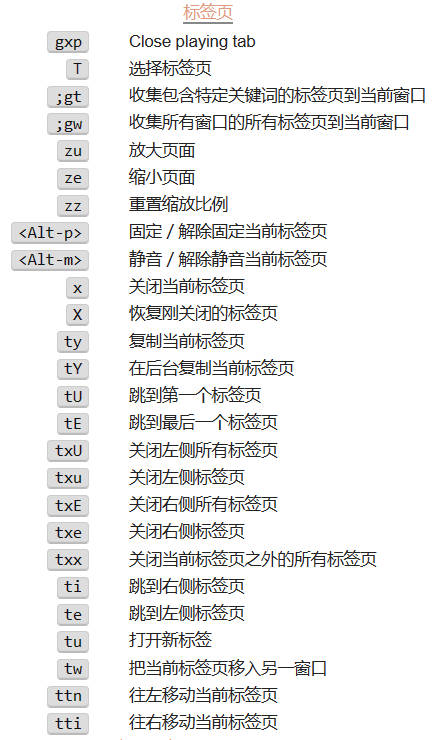

# colemak_config_for_surfingkeys
This is a colemak config for [surfingkeys](https://github.com/brookhong/Surfingkeys). 

# Keymap

## scroll page 滚动页面

| keys | 功能               |
|------|--------------------|
| gu   | 滚到最上边         |
| ge   | 滚到最下边         |
| %    | 滚动百分之x        |
| e    | 向下滚动           |
| u    | 向上滚动           |
| n    | 向左滚动           |
| i    | 向右滚动           |
| he   | Scroll half page down |
| hu   | Scroll half page up   |
| E    | Scroll full page down |
| U    | Scroll full page up   |
| N    | 滚到最左边         |
| I    | 滚到最右边         |

## tab

## mouse click 鼠标点击

|  keys        | 功能                             |
|--------------|----------------------------------|
|   <Ctrl-h>   | 触发元素的鼠标移入事件             |
|   <Ctrl-j>   | 触发元素的鼠标移出事件             |
| fn           | Open a link, press SHIFT to flip overlapped hints, hold SPACE to hide hints    |
| fi           | 在新标签页打开多个链接             |
| fe           | 在新标签页打开链接                |
| fu           | 在新标签页后台打开链接            |
| ff           | 点击图片或按钮                     |
| F            | 下载图片                          |
